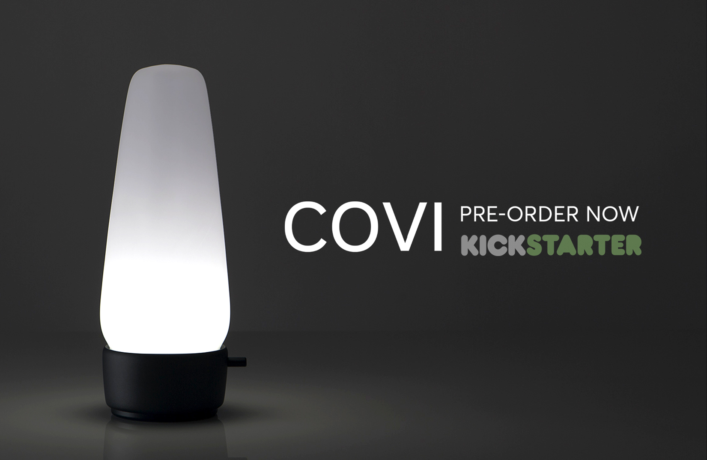
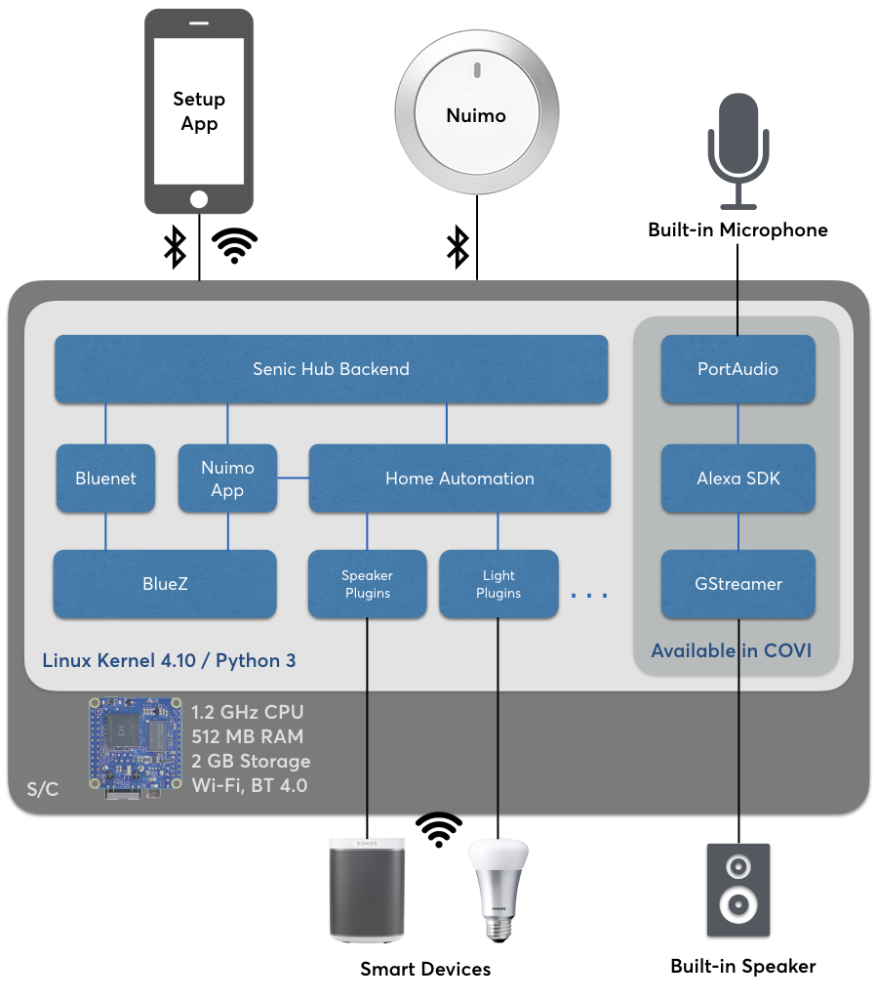

.. _main_index:

**************************************************
Senic COVI and Senic Hub – Technical Documentation
**************************************************

:Author: Senic GmbH
:Last Updated: |today|

Live on Kickstarter
===================

`Senic COVI, our speech-enabled lamp and open-source hub is now live on Kickstarter! <https://www.kickstarter.com/projects/802159142/covi-speech-enabled-light-and-open-source-smart-ho>`_

What is Senic COVI
==================

Senic COVI is a **Bluetooth Low Energy 4.0, Wi-Fi and Alexa speech-enabled smart home lamp** that allows users to connect and control to their smart devices (such as Sonos, Philips Hue etc). It also works together with the `Senic Nuimo <https://www.senic.com/en/nuimo>`_, our very own Bluetooth Low Energy controller for smart devices and significantly extends its capabilities by eliminating the need to have a smart phone or tablet as a bridge.

The Senic Hub is a smaller version that serves the same purpose of being a versatile smart home hub to connect with Nuimo and smart devices. Apart from the lighting feature and Alexa speech support, the Senic Hub is built on the same software stack as Senic COVI.

.. pull-quote::

    The software stack powering COVI is not only entirely built on many great open source projects (surprise!) but we also decided to open up our own stack from the very start -- and this here is its documentation.

Why We Built the Senic COVI
===========================

`Senic COVI <http://blog.senic.com/posts/what-were-building-next>`_ is the first major step in Senic’s vision to make technology that is `not focused on ‘stickiness’ <http://blog.senic.com/posts/the-problem-of-attention>`_ but on `wellbeing for the human <http://blog.senic.com/posts/design-for-wellbeing>`_.
At Senic, we see a big problem in companies creating apps and products that try to maximize the time that their users spent engaged with them.
Instead we would like to promote wellbeing by creating connected devices, experiences, interfaces and systems that provide users with seamless technological experiences, without constantly demanding or even just encouraging their attention or focus.

System Overview
===============

Decisions, Decisions...
=======================

When initially brainstorming how to build such a product we knew we would need to make it unobtrusive and easy to use but also easy to develop for and easy to keep up-to-date so we were confronted very early on with many important technical decisions.
Some of these decisions were pretty clear or self-evident from the beginning, while others required a thorough understanding of both what our smart home users actually need but also what we are able to build with the fairly limited resources of a small startup.
So before we dive into the details of *how* we ended up doing these things, we would like to take the time and outline our reasoning behind some of these decisions and key insights, requirements and learnings.

Hardware Platform: NanoPi Neo
-----------------------------

.. image:: nanopi-neo.png
   :align: right
   :width: 103 px
   :height: 92 px

Senic COVI and Senic Hub are powered by the `NanoPi Neo <http://wiki.friendlyarm.com/wiki/index.php/NanoPi_NEO>`_, a tiny (4x4 cm) but powerful single-board computer equipped with an Allwinner H3 Quad-core 1.2GHz CPU and 512 MB DDR3 RAM.

One of the most decisive factors in favour of this board is the fact that it is actually *designed to be included in a product* -- unlike, say, more commonly known, "fruit-flavoured" boards such as the Raspberry Pi etc. which are explicitly targetted at hobbyists and students to experiment with.

However, we found that satisfactory runtime stability, heat dissipation etc. were basically not achievable with those offerings.

We ship it with a 2 GB high-speed memory card that stores the operating system, software stack and user data.
More importantly, we extend it with `carefully chosen <https://github.com/getsenic/wifi-ble-link-quality-benchmark>`_ high class **Wi-Fi, Bluetooth 3.0 and Bluetooth 4.0 dongles** to provide the best possible wireless connectivity within the given physical constraints.

Operating System: Linux
-----------------------

.. image:: linux-tux.png
   :align: right
   :width: 100 px
   :height: 118 px

For COVI, we wanted to use open-source components as much as possible, not just because we ourselves are avid users of and even contributors to `Free and Open-Source Software <https://en.wikipedia.org/wiki/Free_and_open-source_software>`_.
We also wouldn't be able to stand behind a product that runs 24/7 in the homes and workplaces of our users and which contains proprietary code whose actual workings could not be verified by ourselves or third parties.

.. note::

    During our evaluation phase we also considered using one of the many BSD flavours, specifically `FreeBSD <https://www.freebsd.org/>`_ because it has a proven track record in the area of stability and security plus a long history of running on the tiniest of platforms long before the term "Internet of Things" was even coined.
    We did however find that while the `H3 is pretty well supported <https://wiki.freebsd.org/FreeBSD/arm/Allwinner>`_, support for Bluetooth is lagging behind and in the case of BLE currently non-existent and so we abandoned that approach.

This pretty much left us with Linux which offers a much broader support for such types of boards, most notably including BLE.

The NanoPi itself comes with `various flavours of Linux <http://wiki.friendlyarm.com/wiki/index.php/NanoPi_NEO#Software_Features>`_, however, even the "light" versions weigh in with 400Mb and they all are geared toward end users who wish to use this platform as their personal development or experimentation field.

In the end we opted for building our own custom distribution using the well-established `yocto project <https://www.yoctoproject.org/>`_.
This allows us to create a fine-tuned distribution without having to start from scratch and importantly we can still benefit from upstream mainline updates, be they security related, performance wise or new features.

Also, reducing the amount of code on the system as well as the number of running processes significantly reduces the attack surface for malware -- we definitely want to do all we can to avoid COVI and the Senic Hub becoming part of the next botnet!

Programming Language: Python
----------------------------

.. image:: python.png
   :align: right
   :width: 115 px
   :height: 112 px

Why did we decide that Python was the right programming language for COVI?
Actually, a better question might be: Why *shouldn’t* we use Python?
If you take a deep dive into the open-source smart home world, you will find a number of do-it-yourself projects and Python is often the language of choice for these DIYers.
This adoption of Python is primarily due to the sheer number of ready-made libraries and Python’s availability for many different operating systems.

In addition, Python is an easy to learn and extremely powerful and expressive as a programming language.
The Python programming language is currently (as of June 2017) the `fourth most popular programming language in the world <https://www.tiobe.com/tiobe-index/>`_.
In the end it was important for us, to not just select a programming language that *we* were comfortable with but also for a significant amount of other people who then could contribute or simply hack the device or easily learn how to do so.

Provisioning the Hub with Wi-Fi: Bluenet
========================================

A customer's `first experience while unboxing a product is crucial <https://blog.ordoro.com/2016/04/19/7-best-unboxing-experiences/>`_.
The very next thing after connecting the COVI to a power plug is to connect COVI to the local Wi-Fi.
Only then can we automatically find all the user's smart devices in their home network.
Providing Wi-Fi and internet access to COVI furthermore enables our integrated Alexa speech service to work.
But how does the user tell COVI which Wi-Fi to connect to?
Since we want to make this process as simple as possible, only wireless technologies qualify.

The usual approach of creating an adhoc Wi-Fi network was quickly disqualified, though, since we need to send sensitive Wi-Fi credentials to COVI.
Also, we don't want our users to have to manually change their active Wi-Fi connection on their smartphones to join COVI's ad-hoc Wi-Fi network.
After evaluating `various wireless provisioning methods <https://www.linkedin.com/pulse/wifi-configuration-iot-devices-dan-walkes>`_, we decided to go with the best solution and implemented the world's first Wi-Fi provisioning library for Bluetooth Low Energy-enabled Linux devices and to call it `Bluenet <https://github.com/getsenic/senic-hub/tree/master/senic_hub/bluenet>`_.

Using Bluenet, COVI's mobile setup app is able to automatically discover and connect to COVI via Bluetooth Low Energy.
After connecting, the app requests and presents all Wi-Fi networks (SSID names) that COVI is seeing nearby.
We ask the user to then select her own Wi-Fi home network and let her enter her password.
Then COVI tries to connect its Wi-Fi adapter to the user's network and lets our setup app know whether it succeeded.
Once COVI is connected to the user's Wi-Fi network all further communications will continue through COVI's REST API over HTTP.

Details, Details
================

Below you can find links to the nitty-gritty details

.. toctree::
    :maxdepth: 3

    senic-hub/index
    senic-os/README
    nuimo-sdks/index
