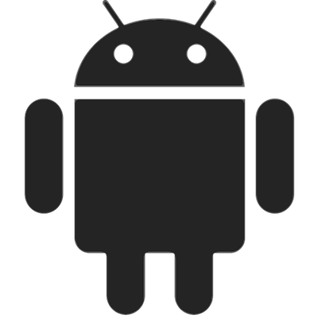
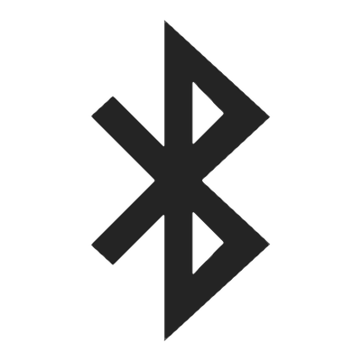

.. _nuimo_sdks:

****************
Senic Nuimo SDKs
****************

Introduction
============

The Nuimo SDKs for all mayor operating systems and platforms help you to quickly implement apps that discover connect to Nuimos. Using our platform SDKs your apps will receive Nuimo gestures and send freely programmable LED output symbols to the device in real-time. Ready-to-run demo apps show how fast and easy it is to write code using the Nuimo SDKs.

Platform SDKs
=============

iOS & MacOS SDK (Swift)
-----------------------

The Nuimo SDK for iOS and MacOS devices. Requires iOS 8.0+ and MacOS 10.10+.

* `Nuimo iOS/MacOS SDK on GitHub <https://github.com/getsenic/nuimo-swift>`_
* `Nuimo SDK Demo for MacOS on GitHub <https://github.com/getsenic/nuimo-swift-demo-osx>`_
* `Nuimo Emulator for iOS on GitHub <https://github.com/getsenic/nuimo-emulator-ios>`_

Android SDK
-----------

The Nuimo SDK for Android devices. Requires Android 4.3+.

* `Nuimo Android SDK on GitHub <https://github.com/getsenic/nuimo-android>`_
* `Nuimo SDK Demo for Android on GitHub <https://github.com/getsenic/nuimo-android-demo>`_
* `Nuimo Emulator for Android on GitHub <https://github.com/getsenic/nuimo-emulator-android>`_

Winwdows SDK
------------

The Nuimo SDK for Windows devices. Requires Windows 10+.

* `Nuimo Windows SDK on GitHub <https://github.com/getsenic/nuimo-windows>`_
* `Nuimo SDK Demo for Windows on GitHub <https://github.com/getsenic/nuimo-windows-demo>`_

Linux SDK (Python)
------------------

The Nuimo SDK for Windows devices. Requires BlueZ 5.43+ – Please find installation instructions in the Linux SDK repository.

* `Nuimo Linux SDK (Python) for on GitHub <https://github.com/getsenic/nuimo-linux-python>`_

Nuimo's BLE GATT Profile
------------------------

Using Nuimo’s Bluetooth Low Energy GATT profile you can connect to Nuimo directly without a platform-specific SDK.

* `Nuimo's BLE GATT profile <https://www.senic.com/files/nuimo-gatt-profile.pdf>`_

NodeJS SDK (3rd Party)
----------------------

`nathankunicki <https://github.com/nathankunicki>`_ provides a Node JS module that a helps connect and communicate with Nuimo in Node JS applications. Please note that we do not provide support for this library, use the `repository's issues section <https://github.com/nathankunicki/nuimojs/issues>`_ instead.

* `Nuimo JS Module maintained by nathankunicki on GitHub <https://github.com/nathankunicki/nuimojs>`_

WebSocket Server for MacOS
--------------------------

If your favorite programming framework/language (e.g. JavaScript, Java, Processing) doesn't support access to Bluetooth Low Energy devices, `download and run the WebSocket Server for MacOS <https://www.senic.com/files/nuimo-websocket-server-osx-1.0.0.zip>`_ on your Mac. The app provides web sockets to read Nuimo input events and to write LED matrices from any programming language with web socket support. `Checkout the github repository  for documentation and code.

* `WebSocket Server App for MacOS <https://www.senic.com/files/nuimo-websocket-server-osx-1.0.0.zip>`_
* `Source code of WebSocket for MacOS on GitHub <https://github.com/getsenic/nuimo-websocket-server-osx>`_
